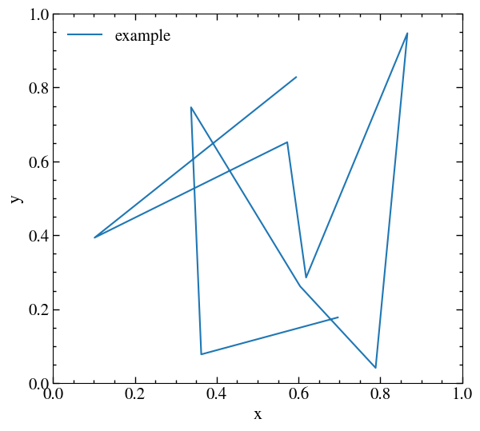

```@meta
CurrentModule = PyPlotUtility
DocTestSetup = quote
    using PyPlotUtility
end
```

# PyPlotUtility.jl

This package provides a number of efficiency models for Diffuse Shock Acceleration (DSA). It provides a number of functions to calculate what fraction of the energy dissipated at a shock is used to accelerate Cosmic Rays (CRs).

# Example

```julia
using PyPlot, PyPlotUtility

fig = get_figure()
plot_styling!()

ax = gca()
axis_ticks_styling!(ax)
ax.set_xlim([0.0, 1.0])
ax.set_ylim([0.0, 1.0])
ax.set_xlabel("x")
ax.set_ylabel("y")

plot(rand(10), rand(10), label="example")

legend(frameon=false)

savefig("example.png", bbox_inches="tight")
```



# Table of contents

```@contents
Pages = [ "index.md", 
          "install.md", 
          "plot_utility.md",
          "calc_utility.md", 
          "propaganda_plot.md"]
Depth = 3
```